Bridge is a toolkit that makes developing a mobile game simpler. The client wanted the icon and the lettering changed, and a lot of the details settled along the way. The name is a metaphor: the kit is a bridge between the picture of a game and its realization in code.

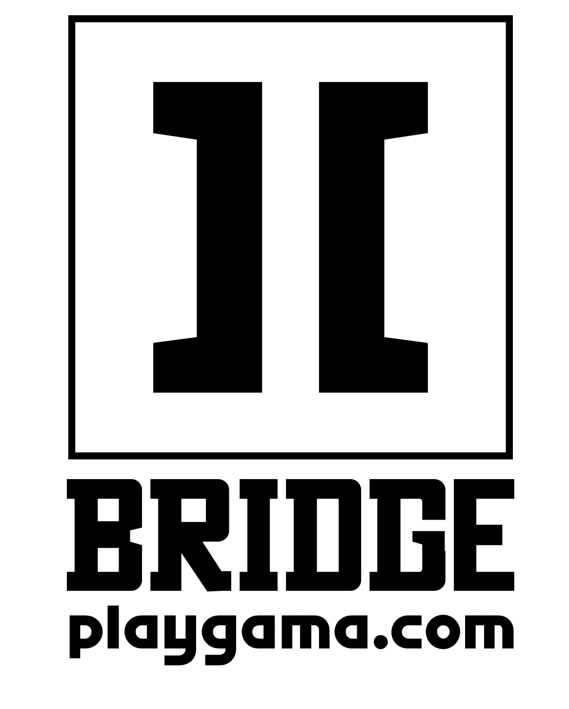+(final-lockup.webp)

The work started by studying how bridges are built, looking for construction ideas that could move into the logo.

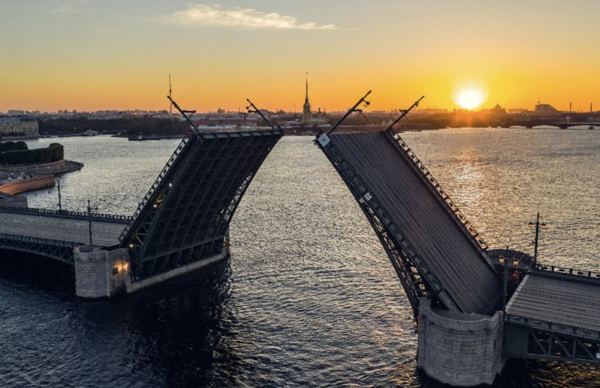+(bridge-arch.jpg)+(bridge-truss.jpg)+(bridge-cables.jpg)

In parallel, each letter of the existing logo had to be assessed.

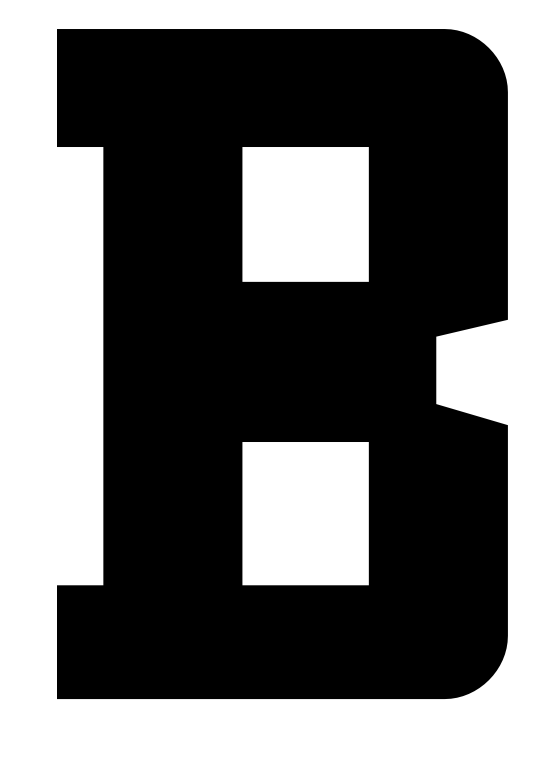

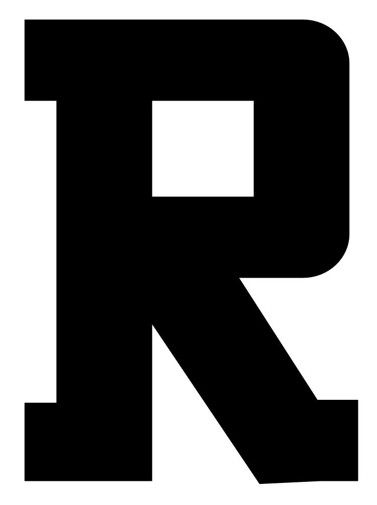

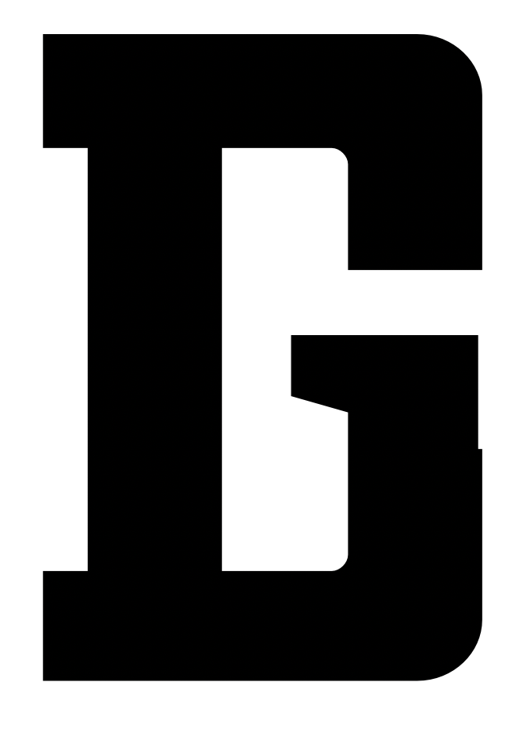

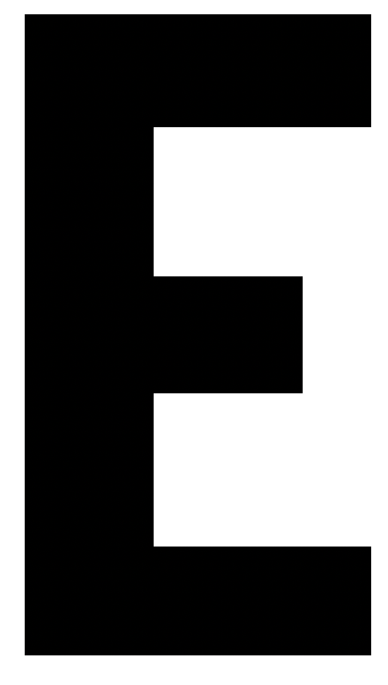

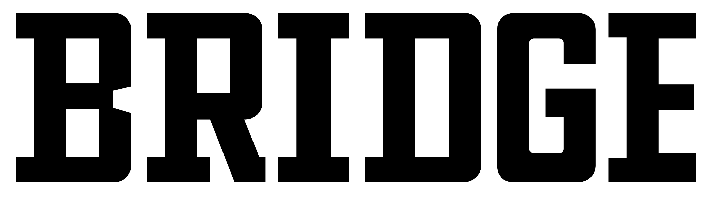+

The art director left the direction open: clean the forms, or push the character through the letters, the icon, and the proportions. A safe version that only fixed the problems was ready quickly. It was fine. The more interesting question was how to make it more characteristic, and whether some of the original flaws could become features.

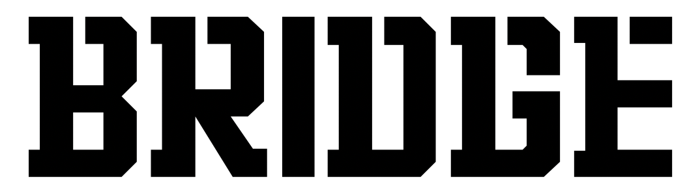+

The first idea was to join the bridge mark to the word by cutting into the letters and turning them into stencils, and to drop the roundings. The roundings would barely show anyway. Diagonal cuts point more clearly at engineering. The stencils added recognition, and they hurt readability.

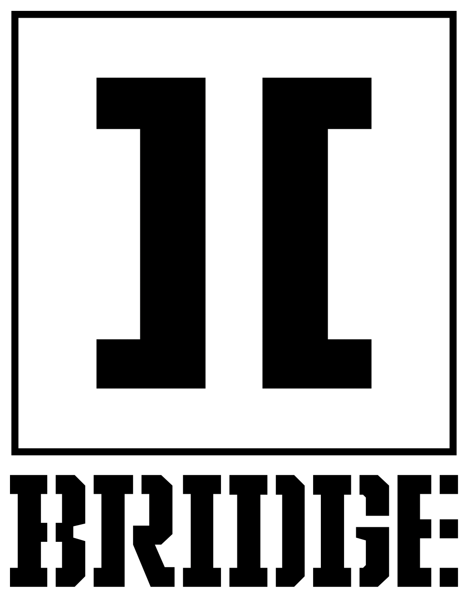+(stencil-2.png)

A third version could sit at small sizes without trouble, but the form still needed refining. That is when the stencil idea was thinned into something readable. The solution came back from the bridge: the stencils disappeared and became cuts that refer to the cross-ties of a bridge.

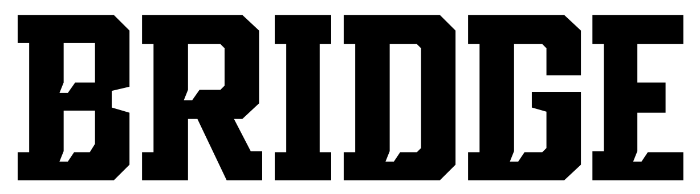+(cuts-2.png)

After that came the search for proportions and weights.

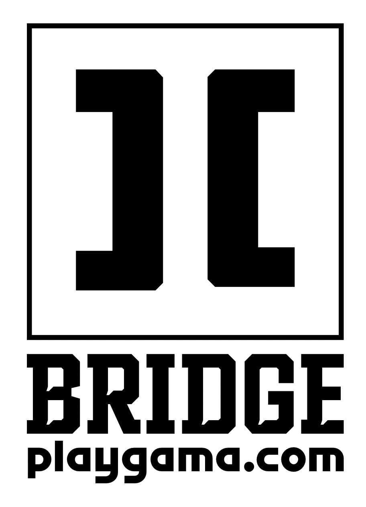

Once the lettering was chosen and approved, the icon still had to be reinvented. The original logo used a road-sign bridge. In the new concept the mark shifts toward brackets, a reference to programming.

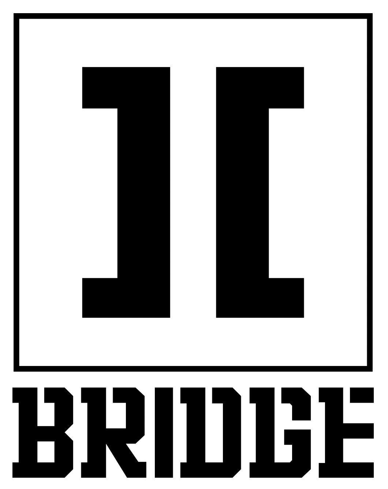+(icon-angled.webp)+(icon-diamond.webp)+(icon-brackets.webp)

To tie the lettering to the mark, the cuts from the letters were added to the icon. Then the logo went to the client and into the mockups.
