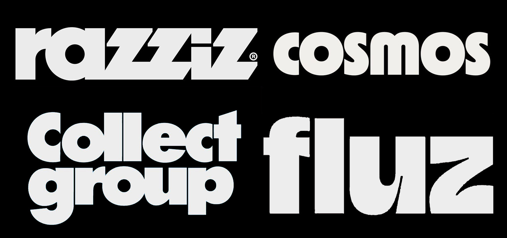
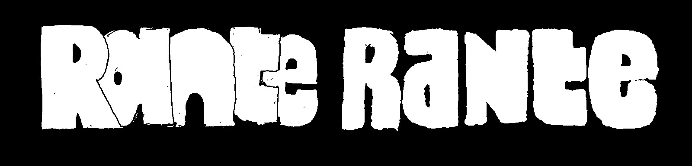
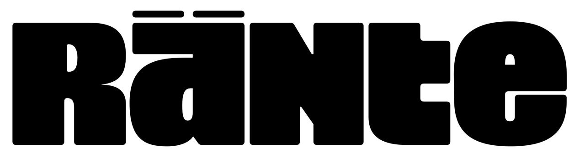
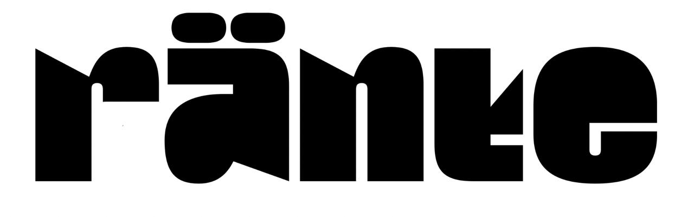
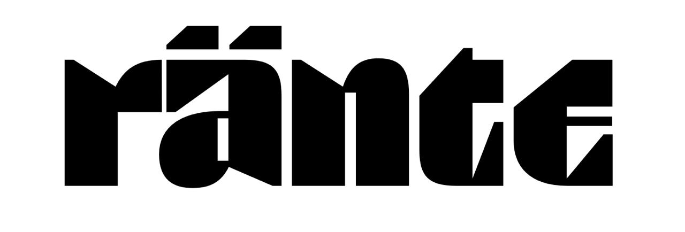

Project started with a message:

*So i've been meaning to ask how much do you charge for a logo, i just want something vibin and mine looks like it came from soviet union. And in latin ofc. I'd want something architectural, massive, but with human touch and softness, maybe just a tiny bit of soviet? Something like:*

I handdrafted two versions just to test hypothesis what image we both have in mind. They are rough and in almost every aspect awful, but they are quick to do and easy to convey the thought.

+

*Yeah, but maybe without overlapping. Not so comic, but more brutal like KTF Compact*

So the mass was the right, and i went further to see what things can be matched inside logo. What cobinations of letters from upper and lower cases would work better. How subtle the detailes were have to be. So i proceeded with vectoral refinements.

+(draft-2.jpeg)

+(draft-4.jpeg)

So the logo was found but later Rante asked for low contrast and cyrillic version to be able to use the logo in all possible sizes and context. Low contrast does not differ much: thin strokes become thicker in order not to dissapear, letters were spaced far liberally to increase legibility