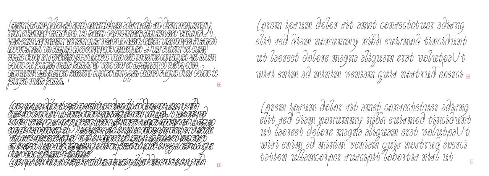

The font started in November 2020. I had almost finished my diploma visual research and was supposed to move on to the diploma typeface. Right then a Type elective appeared for the third year, taught by Nik Nedashkovsky. I started going too.

The assignment for the module was to make a typeface based on a modular ruler. I drew this sheet, and I still remember thinking, looking at it: “and what am I supposed to do with you?”

Then came the search for how to get any letters at all out of that abstraction, and, more importantly, how to derive them from the ruler. To make my life a little easier I started with the capitals, and in a couple of days the whole set came together. Then came the turning point — lowercase had to be added to the typeface.

I really wanted to bring the characteristic loops from the capitals into them, and I had to go to a lot of trouble to get them in. When a minimal character set appeared I immediately saw Cy Twombly’s paintings in them. But that only made things harder and raised the question: do I want to make an homage, or just something inspired? That’s always how it is with typefaces — you never know where you’ll end up following a particular decision.

Formally speaking I made a very small change — I increased the height of the lowercase — but the typeface completely changed its image. Line spacing could be cut in half, and that way you got a texture exactly like the paintings.

At that point the module ended, but I was too shy to bring the typeface to that review. Still, I now knew exactly what I had to do — finish what I’d started. Because of work on the diploma typeface I didn’t touch Tangley for about nine months. And even though I consider my diploma very weak from a type point of view — I learned a lot and could look at this project in a completely new way. When you understand how italic works, it’s much easier to draw. Who would have thought.

After that it was a small matter — correct the letter shapes, tighten the letter-spacing, and draw two and a half hundred characters :) There’s even a schwa in the typeface now, who knows why…
