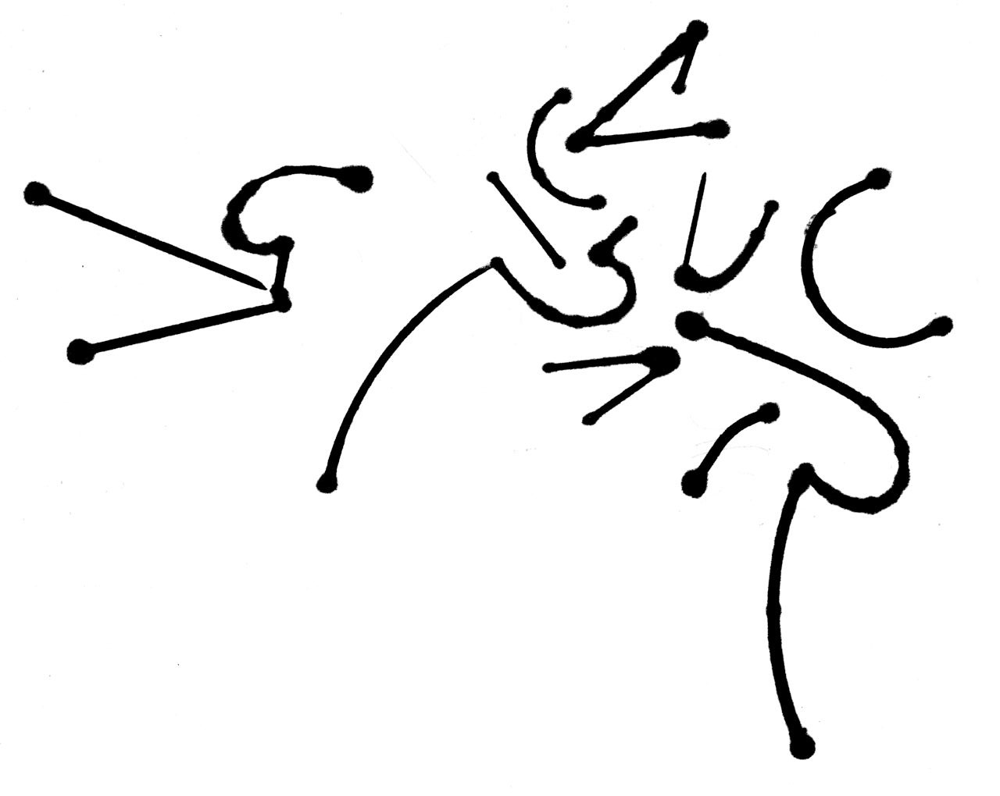
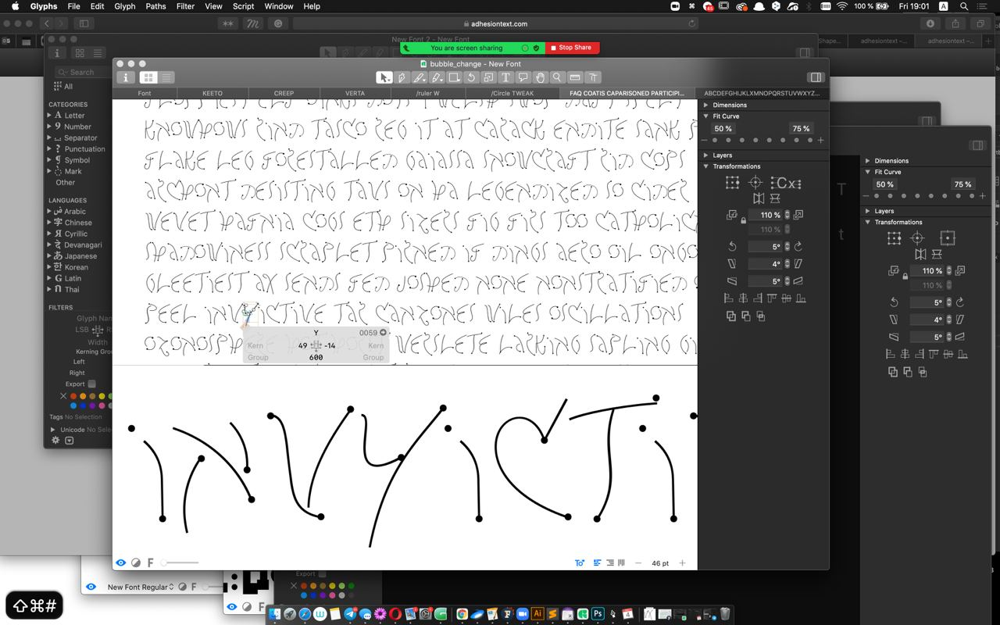
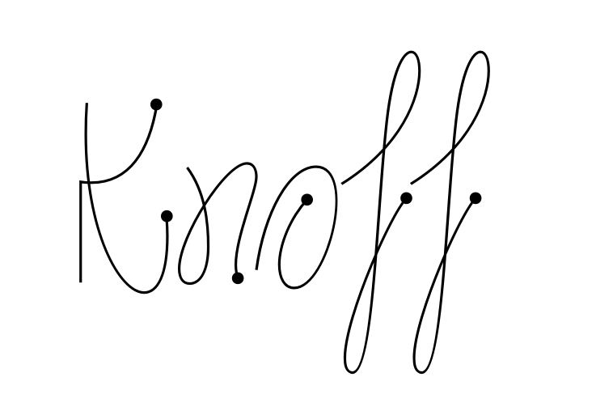

Work on the typeface started in November 2020. Back then i was 4 year student preparing diploma project. Suddenly a type course was announced for 3 year students. It was first type couse in the university and was led by famous Nik Nedashkovsky. So i enrolled there as fast as i could.

The assignment for the course was to make a typeface based on a modular ruler. I created this one particular piece. I was looking at it thinking “and what am I supposed to do with you?”

Then came the search for how to get any letters at all out of that abstract artwork.To make my life a little easier I started with the capitals, and in a couple of days the whole set came together. Dots from marker were one of features of the typeface, back then.

Then came the turning point — lowercase had to be added to the typeface. I really wanted to bring the characteristic loops from the capitals into them and had to go through a lot of trouble to squeeze them in. When a minimal characterset was assembled I immediately saw Cy Twombly’s paintings in them. But that only made things harder and raised the question: do I want to make an homage, or just something inspired by? I guess that’s always how it is with typefaces — you never know where you’ll end up following a particular decision.

+(Plun.jpeg)

I made a very small change — increased the height of the lowercase, but the typeface completely changed its image. Line spacing could be cut in half, and that way you got a texture exactly like the paintings. 

+(texture.jpeg)

After several different tests of how tight i can make the letters, how skewed i moved on to expand characterset. At that point the course ended, but I was too shy to bring the typeface to that review. Still, I wanted to finish this weird journey. Because of work on the diploma typeface I didn’t touch Tangley for months. After that it was a small matter — correct the letter shapes, tighten the letter-spacing, and draw two and a half hundred more characters. There’s even a schwa in the typeface now, who knows why…
